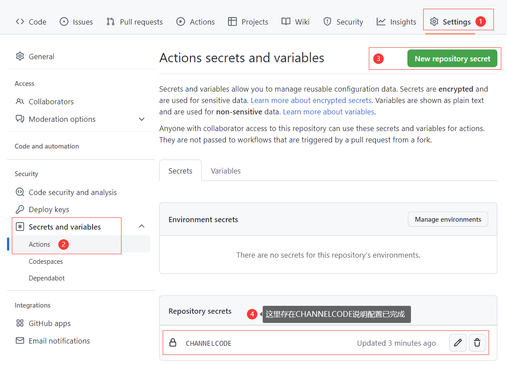

# 一封传话聚合推送 GitHub Action


## 使用方法

1. 将 channelCode 添加到仓库的 Actions secrets 中，命名为 CHANNELCODE 

  

2. 在 workflow 中使用，例子如下：

```yml
- uses: josStorer/get-current-time@v2.0.2
  id: current-time
  with:
    format: YYYYMMDD-HH
    utcOffset: "+08:00"
- uses: teakong/github-action-yifengchuanhua@v1.0.0
  with:
    channelCode: ${{ secrets.channelCode }}
    head: "您有一条新的消息请注意查收 ${{ steps.current-time.outputs.formattedTime }}"
    body: "可以为空。支持Markdown"
```

一个完整的例子：

在仓库根目录新建 `.github/workflows/test.yml`，内容如下：

```yaml
name: 'build-test'
on:
  push:
jobs:
  test:
    runs-on: ubuntu-latest
    steps:
      - name: 一封传话
        uses: teakong/github-action-yifengchuanhua@v1.0.0
        with:
          channelCode: ${{ secrets.channelCode }}
          head: "您有一条新的消息请注意查收 💬"
```
